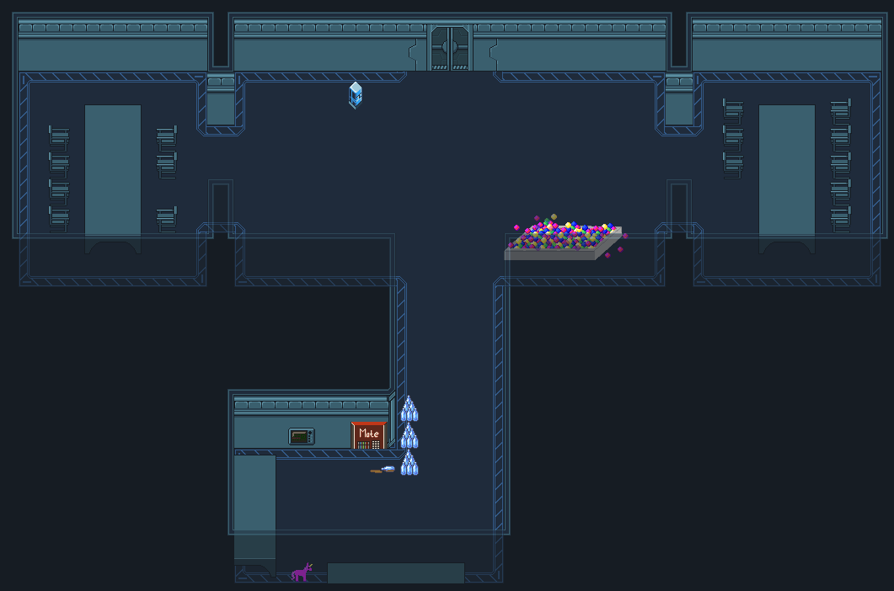
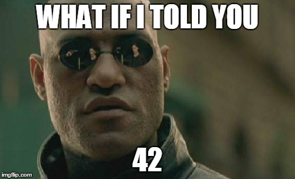

:css: style.css

.. title:: Quest for Coffee

----

:data-x: 0
:data-y: 0
:data-scale: 1

Quest for Coffee
================

Markus Pöschl & Alex Mayer

* WIFI: {Insert WIFI here}
* Pass: {Insert Pass here}

----

:data-x: r2400
:data-y: 0

Sponsor
-------

PIXEL Group GmbH

Simon Ashdown

----

Important things first
----------------------

* Pizza's will arive at about 8:00 PM.
* Drinks and snacks in the kitchen.
* Official end is 10 PM but we will stay til the end.

We also have vegetarians covered. ;)

----

What will be doing today?
-------------------------

* We have a digital playfield

* and a story with riddles

* and some rules

----

.. image:: images/rules.jpg

Rules
-----

* During the event, don't enter one of the folders of the GitHub Repository.
   * Only the `solutions.yaml` is the important file for you.
   * Also browsing the javascript sources in the dev tools is not allowed.
* All riddles will affect the whole spaceship
   * When a riddle is solved every player will see a challanges
* Have fun

----

Tutorial
--------

To the virtual playground:

https://github.com/HacktoberfestMunich/quest-for-coffee